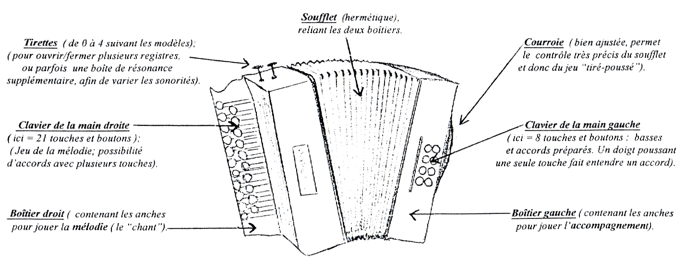
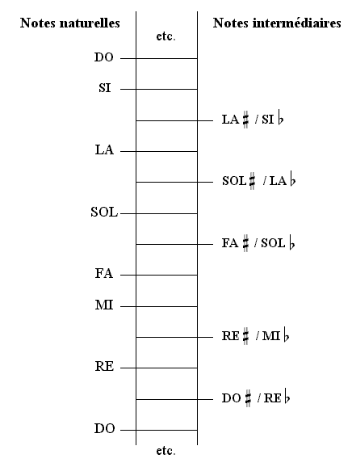
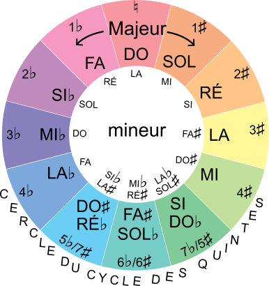

```{r setup, include = F}
knitr::opts_chunk$set(
	fig.align = "left",
	fig.height = 6,
	message = FALSE,
	warning = FALSE,
	results = "asis"
)
# Chargement des fonctions et librairies

library(here)
library(dplyr)
library(music)
library(dplyr)
library(tidyverse)
library(kableExtra)
library(cowplot)

files <- list.files("functions", pattern = "\\.R$", full.names = TRUE)
files <- sort(files)
source(here("code/packages.R"))
invisible(lapply(files, source))


```



# Partie 1 - Généralités

## Clavier Jean Paul Leray

```{r results="asis"}

clavier <- typeClavier(rangsMD = "3 rangs", basses = "18 basses")
plan <- planClavier(MD = "Sol/Do/JPL", MG = "Classique")

clav <- calc_coord(clavier, plan)
clav$halfcircles$main_droite <- build_halfcircles(clav$plan$main_droite)
clav$halfcircles$main_gauche <- build_halfcircles(clav$plan$main_gauche)

create_clavier_plot(
      clav, 
      dispNotes = T,
      dispNumeros = T,
      dispAccord = F, 
      dispGamme = F)

sens_soufflet <- clav$plan$main_droite %>%
  group_by(note) %>%
  select(note, soufflet) %>%
  mutate(soufflet = if_else(soufflet == "P", "poussé", 
                            "tiré")) %>%
  pivot_wider(id_cols = note, names_from = soufflet, values_from = soufflet, 
              values_fn = unique) %>%
  mutate(disponibilité = case_when(
    is.na(poussé) & is.na(tiré) ~ "non", 
    !is.na(poussé) & !is.na(tiré) ~ "oui",
    !is.na(poussé) & is.na(tiré) ~ "en poussé",
    is.na(poussé) & !is.na(tiré) ~ "en tiré")) %>%
  select(note, disponibilité)
```

## Gamme chromatique

```{r}
gammeC <- c("C", "C#", "D", "Eb", "E", "F", "F#", "G", "G#", "A", "Bb", "B")
cat(paste0("La gamme chromatique contient l'ensemble des 12 notes : ", combine_wordsFr( convert_to_french_notes(gammeC)), ". Chaque note est séparée d'un demi-ton de la précédante."))
```



## Cercles des quintes

{fig-align="center"}

\newpage

# Partie 2 — Gammes diatoniques

```{r gammes, results='asis'}

gammes_majeures <- c("C","G","F", "D", "Bb", "A", "Eb", 
                     "E","G#", "B","C#", "F#")


for (tonic in gammes_majeures) {


  gammeM <- find_scale(tonic, "major", clav)
  gammeM <- write_about_scale(gammeM)
  
  cat("\n\\newpage\n")
  cat(paste0("## Gamme de ", gammeM$name, "\n"))
  #cat(paste0(gammeM$description, "\n"))

  df <- gammeM$tableau 
# Transformation
df_wide <- df %>%
 mutate(composition = linebreak(str_replace_all(composition, "-", " "), align = "c")) %>%
  pivot_longer(cols = c(degrés, noms, accord, composition), 
               names_to = "variable", values_to = "valeur") %>%
  pivot_wider(names_from = notes, values_from = valeur) %>%
  select(-variable)

# Affichage propre 
print(kable(df_wide, align = "c") %>%
        kable_styling(latex_options = c("striped", "hold_position", "scale_down"), 
                      stripe_color = "gray!8", font_size = 6) %>%
        row_spec(0, bold = TRUE) %>%
        pack_rows("Accord", 3, 4, hline_before = T) %>%
        column_spec(c(1:7), width = "1.2cm"))
    
  
  
  p <- create_clavier_plot(
    clav,
    accord = NULL,
    scale = gammeM,
    dispNotes = F,
    dispNumeros = FALSE,
    dispAccord = FALSE,
    dispGamme = TRUE
  )
  
  
  print(p)
  cat("\n\n")

  
}

```

\newpage

# Partie 3 — Accords

```{r accords, results='asis'}

roots <- c("C", "D", "E", "F", "G", "A", "B", "F#", "Bb", "G#", "Eb", "C#")
types <- c("major", "minor", "7th", "minor7th")

for (root in roots) {
  
  #cat(paste0("\n\\newpage\n\n## Accords de ", convert_to_french_notes(root), "\n\n"))
  for (type in types) {
    
    acc <- find_chord(root, type, clav)
    acc <- write_about_chord(acc)
    cat("\n\\newpage\n")
    cat(paste0("## ", acc$name, "\n\n"))
    cat(paste0(acc$description, " ", acc$dispo, "\n\n"))

    p <- create_clavier_plot(
      clav,
      accord = acc,
      scale = NULL,
      dispNotes = F,
      dispNumeros = FALSE,
      dispAccord = TRUE,
      dispGamme = FALSE
    )
    # if(acc$tire$oui | acc$pousse$oui){
    # pos <- create_position_plot(
    #   clav, 
    #   accord = acc,
    #   dispNotes = TRUE)} else {pos <- NULL}

    #print(plot_grid(p, pos, ncol = 2, nrow = 1))
    print(p)
    cat("\n\n")
    
  }
}
```
